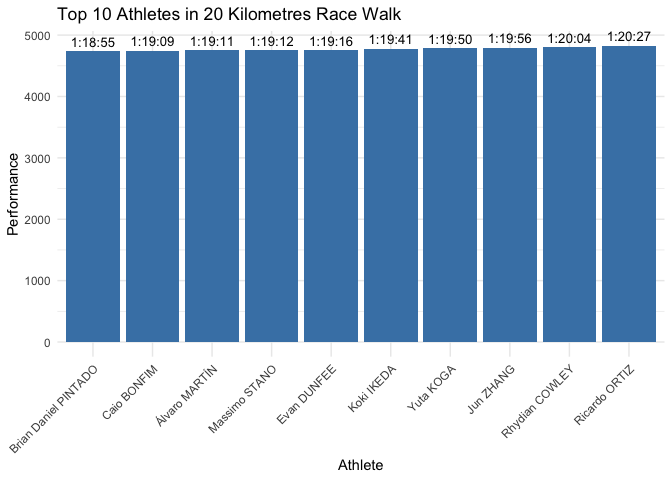

<!-- README.md is generated from README.Rmd. Please edit that file -->

# blue

<!-- badges: start -->

[](https://github.com/Helenzzz07/blue/actions/workflows/R-CMD-check.yaml)
[](https://app.codecov.io/gh/Helenzzz07/blue)
<!-- badges: end -->

The blue package provides a simple R interface to track Paris 2024
Olympic Games (Track and Field results.  
It is distinct from other packages because it includes 2024 data and
supports specific athlete-level filtering

## Installation

You can install the development version of blue from
[GitHub](https://github.com/) with:

``` r
# install.packages("devtools")
devtools::install_github("Helenzzz07/blue")
```

## Example

This is a basic example that shows how to look up and visualize an
athlete’s performance:

``` r
library(blue)

# Find the results URL for a specific athlete
find_athlete("Álvaro MARTÍN")
#> [1] "https://worldathletics.org/results/olympic-games/2024/the-xxxiii-olympic-games-7087/men/20-kilometres-race-walk/final/result#resultheader"

# Plot the athlete's performance
plot_event_top10 ("20 Kilometres Race Walk")
```



``` r
# Warning: Athlete not found.
plot_event_top10("Fake Athlete")
#> Warning in plot_event_top10("Fake Athlete"): No valid data found for event:
#> Fake Athlete
#> NULL
```
